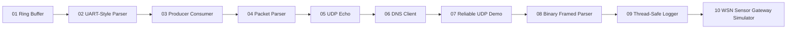
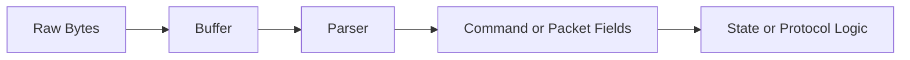

# Firmware Systems Lab

This repository is a firmware-focused C practice portfolio built around memory,
buffers, protocol parsing, synchronization, UDP, and low-level systems concepts.

It is designed to complement a higher-level TCP/IP networking portfolio by
focusing on the kind of fundamentals that show up in firmware, embedded
software, and low-level systems interviews.

## Architecture Overview

## Firmware Data Flow Themes

## What This Repo Covers

- ring buffer design
- byte stream parsing
- producer-consumer synchronization
- raw packet field extraction
- UDP client/server behavior
- DNS packet construction and parsing
- basic reliability ideas built on top of UDP
- binary framed protocol parsing
- thread-safe shared utility design
- wireless sensor network style node-to-gateway simulation

## Project Roadmap

### 01. Ring Buffer

Path:

- `projects/01-ring-buffer`

Concepts:

- fixed-capacity storage
- head/tail index movement
- wrap-around behavior
- full vs empty handling

### 02. UART-Style Parser

Path:

- `projects/02-uart-style-parser`

Concepts:

- byte-by-byte input
- line-based command parsing
- ring buffer plus parser flow

### 03. Producer Consumer

Path:

- `projects/03-producer-consumer`

Concepts:

- `pthread`
- `mutex`
- `condition variable`
- synchronized queue access

### 04. Packet Parser

Path:

- `projects/04-packet-parser`

Concepts:

- raw byte buffers
- big-endian field parsing
- IPv4 header structure

### 05. UDP Echo

Path:

- `projects/05-udp-echo`

Concepts:

- `SOCK_DGRAM`
- `recvfrom()` / `sendto()`
- connectionless communication

### 06. DNS Client

Path:

- `projects/06-dns-client`

Concepts:

- DNS query packet layout
- UDP transport
- binary protocol parsing
- `A` record extraction

### 07. Reliable UDP Demo

Path:

- `projects/07-reliable-udp-demo`

Concepts:

- sequence number
- ACK
- timeout and retry
- stop-and-wait reliability

### 08. Binary Framed Parser

Path:

- `projects/08-binary-framed-parser`

Concepts:

- frame header parsing
- length-delimited payload handling
- checksum validation
- state machine parsing

### 09. Thread-Safe Logger

Path:

- `projects/09-thread-safe-logger`

Concepts:

- mutex-protected shared resource access
- multi-thread safe component design
- timestamped logging

### 10. WSN Sensor Gateway Simulator

Path:

- `projects/10-wsn-sensor-gateway-simulator`

Concepts:

- multiple sensor nodes
- gateway collection flow
- packet loss simulation
- battery drain tracking
- basic reliability metrics

## Suggested Reading Order

1. `projects/01-ring-buffer`
2. `projects/02-uart-style-parser`
3. `projects/03-producer-consumer`
4. `projects/04-packet-parser`
5. `projects/05-udp-echo`
6. `projects/06-dns-client`
7. `projects/07-reliable-udp-demo`
8. `projects/08-binary-framed-parser`
9. `projects/09-thread-safe-logger`
10. `projects/10-wsn-sensor-gateway-simulator`

## Why This Repo Exists

This repo is meant to strengthen firmware-style foundations:

- buffer management
- memory layout thinking
- state-driven logic
- embedded-friendly data structures
- protocol parsing
- systems programming basics

## Good Resume Keywords

- C
- Firmware
- Embedded Systems
- Ring Buffer
- UART Parser
- Packet Parsing
- UDP
- DNS
- Producer Consumer
- `pthread`
- State Machine Parser
- Thread-Safe Logger
- Wireless Sensor Networks
- Gateway Simulation
