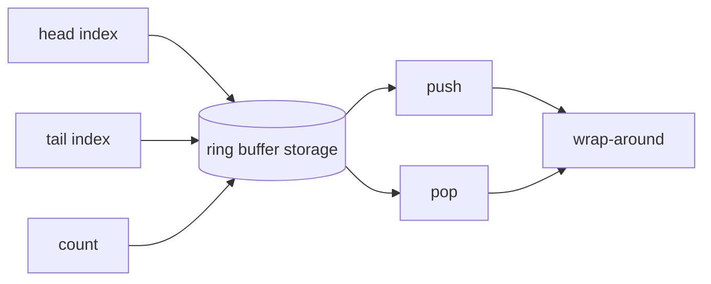

# 01 Ring Buffer

This project is a firmware-style fixed-capacity ring buffer written in C.

## Why This Matters

Ring buffers show up everywhere in firmware and low-level systems work:

- UART receive buffers
- producer/consumer queues
- packet buffering
- streaming data pipelines

## What This Project Covers

- fixed-size storage
- head/tail index movement
- full vs empty handling
- wrap-around behavior
- API design with explicit success/failure return values

## Structure



## Build

```sh
cd /Users/caita/firmware-systems-lab/projects/01-ring-buffer
make
```

## Run

```sh
./ring_buffer_demo
```

## Files

- `ring_buffer.h`: public API and struct definition
- `ring_buffer.c`: implementation
- `main.c`: small demo that exercises push, pop, full, and wrap-around
