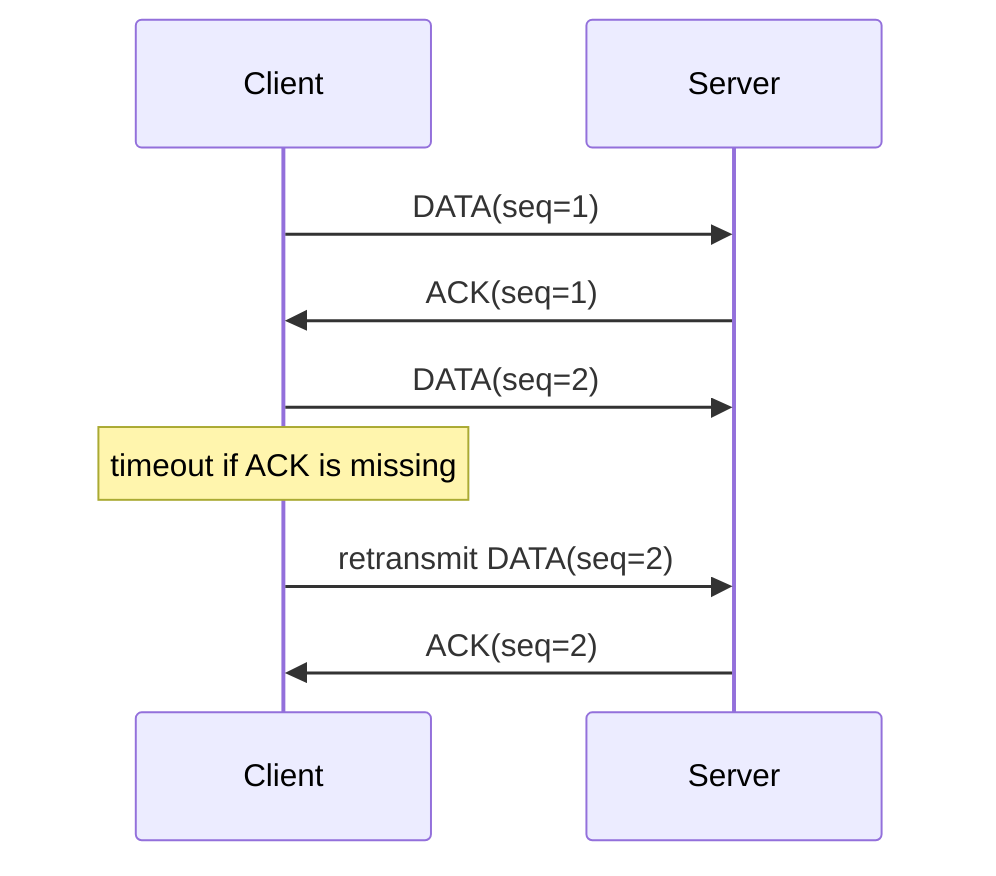

# 07 Reliable UDP Demo

This project is a minimal reliability layer built on top of UDP.

## Why This Matters

UDP does not guarantee delivery, ordering, or retransmission. This project shows
the basic ideas behind adding reliability at the application layer.

## What This Project Covers

- sequence numbers
- ACK packets
- timeout with `select()`
- retry / retransmission
- simple stop-and-wait behavior

## Reliable Flow



## Build

```sh
cd /Users/caita/firmware-systems-lab/projects/07-reliable-udp-demo
make
```

## Run

Start the server:

```sh
./reliable_udp_server 9100
```

Start the client:

```sh
./reliable_udp_client 127.0.0.1 9100
```

## Notes

This is intentionally a small demo, not a full protocol stack. It is meant to
show the core ideas behind reliable delivery on top of UDP.
