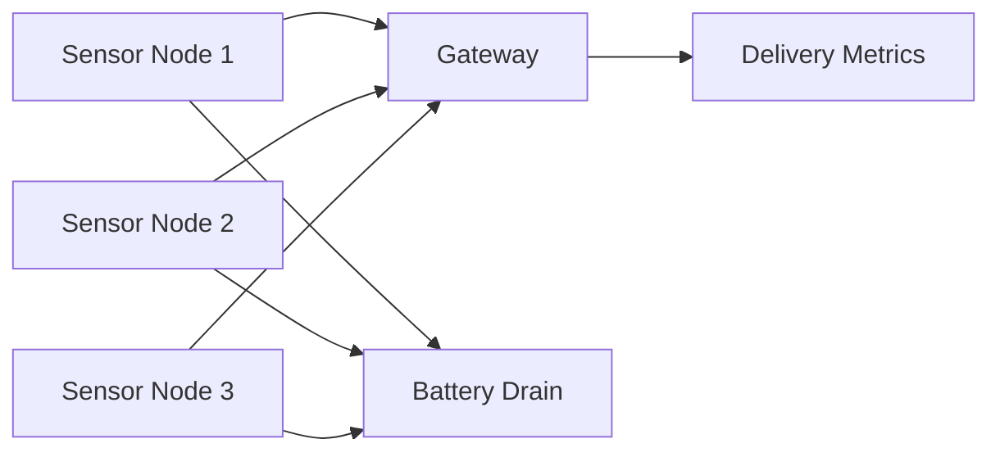

# Architecture

## Key Ideas

- multiple nodes periodically report data
- a gateway receives or misses reports
- packet loss can be simulated by scenario
- retry can be turned on or off
- metrics summarize delivery ratio and battery impact
