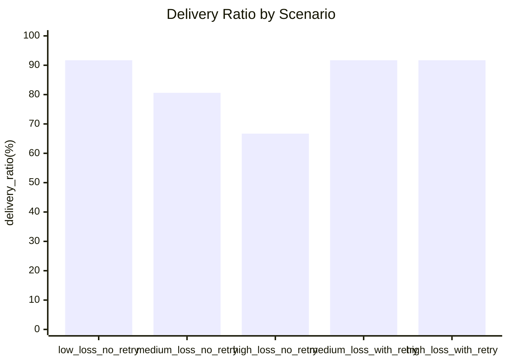

# Experiments

This project compares multiple wireless-sensor-network style scenarios with and
without retry.

## Experiment Design

Scenarios:

1. `low_loss_no_retry`
2. `medium_loss_no_retry`
3. `high_loss_no_retry`
4. `medium_loss_with_retry`
5. `high_loss_with_retry`

Metrics:

- received packets
- dropped packets
- delivery ratio
- retry attempts
- retry successes
- average remaining battery

## Result File

- `results/scenario_metrics.csv`

## Result Table

| Scenario | Received | Dropped | Delivery Ratio | Retry Attempts | Retry Successes | Avg Battery |
| --- | ---: | ---: | ---: | ---: | ---: | ---: |
| low_loss_no_retry | 33 | 3 | 91.7% | 0 | 0 | 90.4% |
| medium_loss_no_retry | 29 | 7 | 80.6% | 0 | 0 | 90.4% |
| high_loss_no_retry | 24 | 12 | 66.7% | 0 | 0 | 90.4% |
| medium_loss_with_retry | 33 | 3 | 91.7% | 7 | 4 | 89.9% |
| high_loss_with_retry | 33 | 3 | 91.7% | 12 | 9 | 89.6% |

## Chart

## Interpretation

- Delivery ratio falls from `91.7%` to `66.7%` as packet loss increases when no retry is used.
- Enabling retry recovers delivery ratio from `80.6%` or `66.7%` back to `91.7%`.
- Retry improves reliability, but costs extra energy, reflected in slightly lower average battery.
